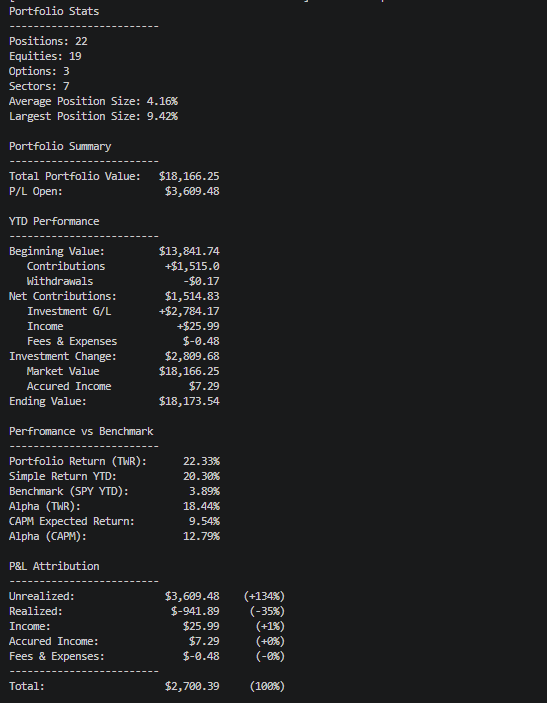
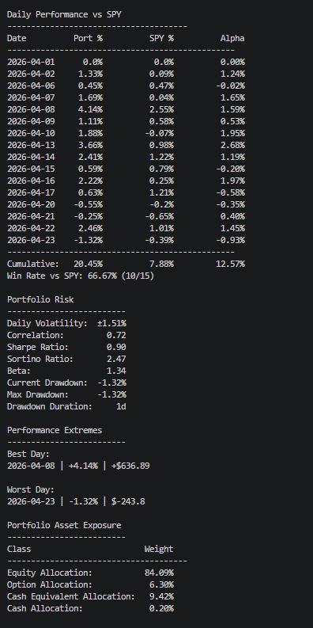

## Portfolio Analytics Tracker (Python + Excel)

Built a portfolio analytics system to evaluate performance, risk, and allocation vs. SPY.

### Key Features
- Time-Weighted Return (TWR) to isolate performance from cash flows  
- SPY benchmarking for relative performance analysis  
- Risk metrics: beta, volatility, drawdown, Sharpe ratio  
- Portfolio allocation and concentration analysis  

### Tech Stack
- Python (pandas, yfinance)  
- Excel  

### Example Output

