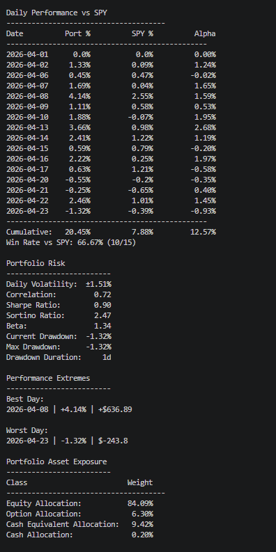

# Python Portfolio Analytics & Performance Tracker
A Python-based portfolio analytics platform for tracking performance, measuring risk, analyzing allocations, and benchmarking investment portfolios.

## Overview

This project automates portfolio performance tracking by calculating returns, risk metrics, portfolio allocation, and benchmarking against the S&P 500 (SPY).

It integrates with the companion Equity Research Engine, allowing research portfolios to be monitored after construction through performance measurement and risk analysis.

## Workflow

### 1. Portfolio Import
- Transaction History
- Price Downloads
- Portfolio History

### 2. Performance Analytics
- Portfolio value
- Unrealized P/L
- Realized P/L
- Time-Weighted Return (TWR)
- YTD performance

### 3. Risk Analytics 
- Beta
- Volatility
- Sharpe Ratio
- Maximum Drawdown
- Concentration Risk

### 4. Allocation Analysis
- Position sizing
- Sector allocation
- Largest holdings
- Diversification Metrics

### 5. Benchmarking
- SPY comparison
- Relative performance
- Alpha/Beta analysis

### 6. Reporting
- Dashboard generation
- Portfolio history
- Performance summaries

 ## Tech Stack
- Python
- Pandas
- NumPy
- yfinance
- SciPy 
- matplotlib
- Microsoft Excel
 

##

 

